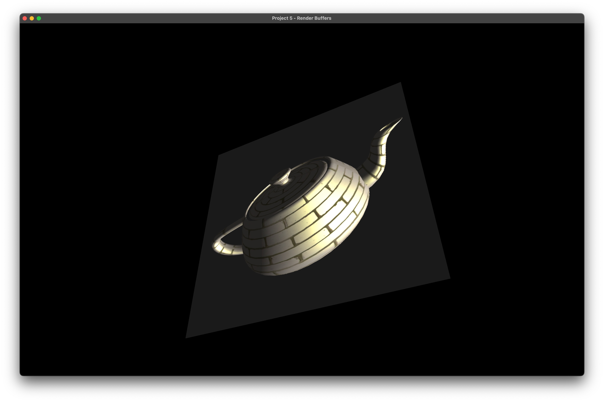
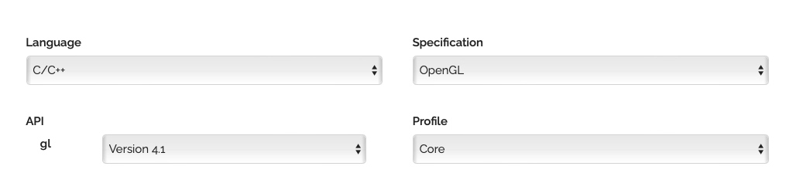

# CS 6610 Project 5 - Render Buffers

## ScreenShot

There is also a video attached in the submission showing the implementation.

## What you implemented
1. Created a Render buffer with the cy code base.
2. Render the result of the original program to the buffered texture.
3. Added a pass rendering a square plane with the buffered texture from previous pass. Utilzed multiple VAOs, multiple shader programs to achieve this, and debugged on those practices.
4. (CS 6610 Requirement) Set the rendered texture's filter mode into bilinear for mag and mipmap for min, and generated mipmap for this texture after rendered.

## Additional functionalities beyond project requirements
The aspect ratio of the window might infulence the result of rendered texture, make it looks incorrect. I used a shader hack to fix that bug.

```glsl
//square.vert

#version 410 core
layout(location=0)in vec3 iPos;

out vec2 oTexCoord;

uniform mat4 mvp;
uniform float aspectRatio;

void main()
{
    oTexCoord = vec2(iPos.x/aspectRatio,iPos.y)/2 + vec2(0.5, 0.5);
    gl_Position = mvp * vec4(iPos, 1);
}
``` 
 
## How to use the implementation

This project is now a Clion project, so we need to run it under this IDE, or others that support cmake.

After download and setup the environment, then click Run in your IDE, and you will see a 16:10 window appear on your screen, contains a textured teapot model with Blinn Shading. 

### List of Inputs

* Hold mouse left and drag, to rotate the view of the internal model;
* Hold mouse left and darg, to rotate the view of the external plane, when ```alt``` or ```option``` is pressed.
* Hold mouse left and drag, to rotate the light direction when ```ctrl``` is pressed; 
* Hold mouse right and drag, to zoom in/out the camera of the internal model.
* Hold mouse right and drag, to zoon in/out the camera of the external plane, when ```alt``` or ```option``` is pressed.
* Press ```Esc``` to exit; 

## Envrionment, OS, External Libraries and Additional Requirements
I developed and tested this project on Latest MacOS 13.2.1, and the architecture is Apple Silicon (Arm64). 

### To setup environment:

1. install [HomeBrew](https://brew.sh).
2. In Terminal, run ```$ brew install glfw ```;
3. Go to [GLAD](https://glad.dav1d.de) online service, choose as this picture. Then click generate. 


4. Download the zip flie, copy the two folders inside the include folder to /opt/homebrew/include. 

The environment is now set up and ready for debugging the project you copied from me.
### To create a empty project under this environment:

1. Create a empty Clion Project. (Or other IDE supports Cmake)
2. Copy the src folder in glad to the root of project. 
3. Drag the main.cpp into src folder.
4. Under the root of project, create a folder named "include". For any external libraries, put in this folder. 
> The best practice for adding include libraries is to use ```git submodule add repo_url include/repo_name``` to have those external libraries installed if you are using git.
5. Then Modify the CMakeLists.txt like this:
```cmake
cmake_minimum_required(VERSION 3.24)
project(Your-Project-Name)

set(CMAKE_CXX_STANDARD 17)

set(CMAKE_OSX_ARCHITECTURES  "arm64" CACHE STRING "Build architectures for Mac OS X" FORCE)

set(GLFW_LINK /opt/homebrew/lib/libglfw.3.dylib)
link_libraries(${OPENGL} ${GLFW_LINK})

add_executable(Your-Executable-Name src/glad.c src/main.cpp)
target_include_directories(Your-Executable-Name PUBLIC /opt/homebrew/include)
target_include_directories(Your-Executable-Name PRIVATE ${PROJECT_SOURCE_DIR}/includes)

if (APPLE)
    target_link_libraries(Your-Executable-Name "-framework OpenGL")
    target_link_libraries(Your-Executable-Name "-framework GLUT")
endif ()
```

### Miscs:

1. I also Included the cyCodeBase, but it's buggy on Apple Silicon Mac unless you disable immintrin.h by adding the first line on the top of main.cpp, as well as the second line to override gluErrorString function, before include cyGL.h:
    ```cpp
    #define CY_NO_IMMINTRIN_H
    #define gluErrorString(value) (#value)
    ```
2. For any included library, if it has any .cpp files, you need to add it to complile list by modfying the CMakeLists.txt like this:
    ```cmake
    add_executable(Your-Executable-Name src/glad.c [library cpp directories] src/main.cpp)
    ```