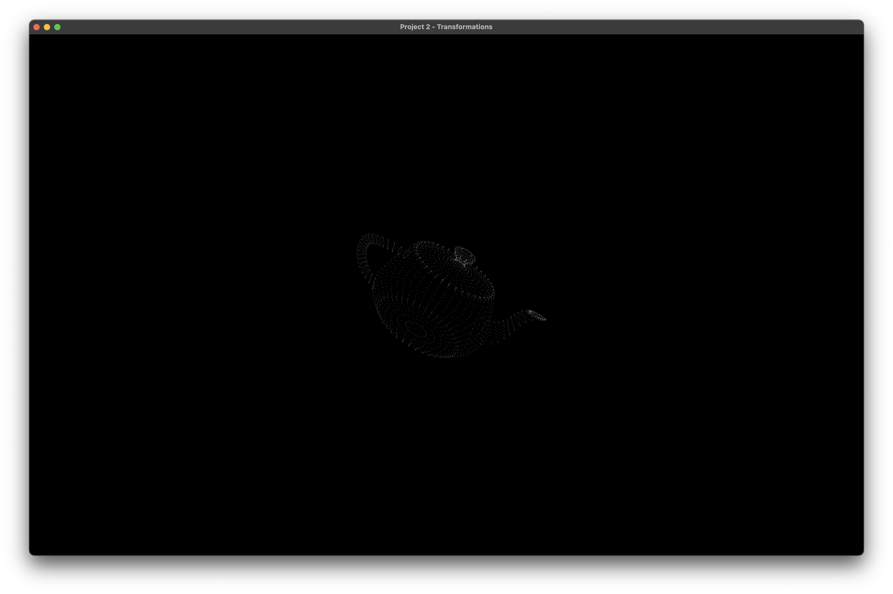

# CS 6610 Project 2 - Transformations

## ScreenShot

## What you implemented
1. Refactor the project upon GLFW, on MacOS, via CMake.
2. VBO/VAO generating and binding.
3. Reading .obj file from argv.
4. Simple Fragment Shader and Vertex Shader.
5. Mouse button callback to register/cancel mouse move callbacks. 
6. Mouse movement Callback to recieve x/y offsets.
7. algorithm that calculate new position and target vector for the View Matrix.
8. (CS 6610 Requirement)F6 recompile the shaders.
9. (CS 6610 Requirement)Centered the Model by translate the model matrix.

## Additional functionalities beyond project requirements
In mouse button callback, I utilized a trick to enable both button hold, and only cancel all callbacks when all buttons released. If I first hold left, I can drag to rotate; then I also hold right button, the fuction will not change; but if I then released left button, the zoom fuction would be registered.

```cpp
int holdCount = 0;

...

void cb_MouseButton(GLFWwindow* window, int button, int action, int mods){
    if(button == GLFW_MOUSE_BUTTON_LEFT || button == GLFW_MOUSE_BUTTON_RIGHT){
        if(action == GLFW_PRESS){
            if(holdCount == 0){
                switch(button){
                    case GLFW_MOUSE_BUTTON_LEFT:
                        glfwSetCursorPosCallback(window, cb_MouseAngles);
                        break;
                    case GLFW_MOUSE_BUTTON_RIGHT:
                        glfwSetCursorPosCallback(window, cb_MouseDistance);
                        break;
                }
            }
            holdCount++;
        }
        if(action == GLFW_RELEASE){
            holdCount--;
            if(holdCount == 0){
                glfwSetCursorPosCallback(window, cb_MouseIdle);
            }
            else {
                switch(button){
                    case GLFW_MOUSE_BUTTON_RIGHT:
                        glfwSetCursorPosCallback(window, cb_MouseAngles);
                        break;
                    case GLFW_MOUSE_BUTTON_LEFT:
                        glfwSetCursorPosCallback(window, cb_MouseDistance);
                        break;
                }
            }
        }
    }
}
``` 
## How to use the implementation

This project is now a Clion project, so we need to run it under this IDE, or others that support cmake.

After download and setup the environment, then click Run in your IDE, and you will see a 16:10 window appear on your screen, contains a model in vertices. 

### List of Inputs

* Hold mouse left and drag, to rotate the view of the model;
* Hold mouse right and drag, to zoom in/out the camera of the model.
* Press ```Esc``` to exit; 
* Press ```F6``` to recompile the shader program.

## Envrionment, OS, External Libraries and Additional Requirements
I developed and tested this project on Latest MacOS 13.2.1, and the architecture is Apple Silicon (Arm64). 

### To setup environment:

1. install [HomeBrew](https://brew.sh).
2. In Terminal, run ```$ brew install glfw ```;
3. Go to [GLAD](https://glad.dav1d.de) online service, choose as this picture. Then click generate. 


4. Download the zip flie, copy the two folders inside the include folder to /opt/homebrew/include. 

The environment is now set up and ready for debugging the project you copied from me.
### To create a empty project under this environment:

1. Create a empty Clion Project. (Or other IDE supports Cmake)
2. Copy the src folder in glad to the root of project. 
3. Drag the main.cpp into src folder.
4. Under the root of project, create a folder named "include". For any external libraries, put in this folder. 
> The best practice for adding include libraries is to use ```git submodule add repo_url include/repo_name``` to have those external libraries installed if you are using git.
5. Then Modify the CMakeLists.txt like this:
```cmake
cmake_minimum_required(VERSION 3.24)
project(Your-Project-Name)

set(CMAKE_CXX_STANDARD 17)

set(CMAKE_OSX_ARCHITECTURES  "arm64" CACHE STRING "Build architectures for Mac OS X" FORCE)

set(GLFW_LINK /opt/homebrew/lib/libglfw.3.dylib)
link_libraries(${OPENGL} ${GLFW_LINK})

add_executable(Your-Executable-Name src/glad.c src/main.cpp)
target_include_directories(Your-Executable-Name PUBLIC /opt/homebrew/include)
target_include_directories(Your-Executable-Name PRIVATE ${PROJECT_SOURCE_DIR}/include)

if (APPLE)
    target_link_libraries(Your-Executable-Name "-framework OpenGL")
    target_link_libraries(Your-Executable-Name "-framework GLUT")
endif ()
```

### Miscs:

1. I also Included the cyCodeBase, but it's buggy on Apple Silicon Mac unless you disable immintrin.h by adding the first line on the top of main.cpp, as well as the second line to override gluErrorString function, before include cyGL.h:
    ```cpp
    #define CY_NO_IMMINTRIN_H
    #define gluErrorString(value) (#value)
    ```
2. For any included library, if it has any .cpp files, you need to add it to compile list by modfying the CMakeLists.txt like this:
    ```cmake
    add_executable(Your-Executable-Name src/glad.c [library cpp directories] src/main.cpp)
    ```