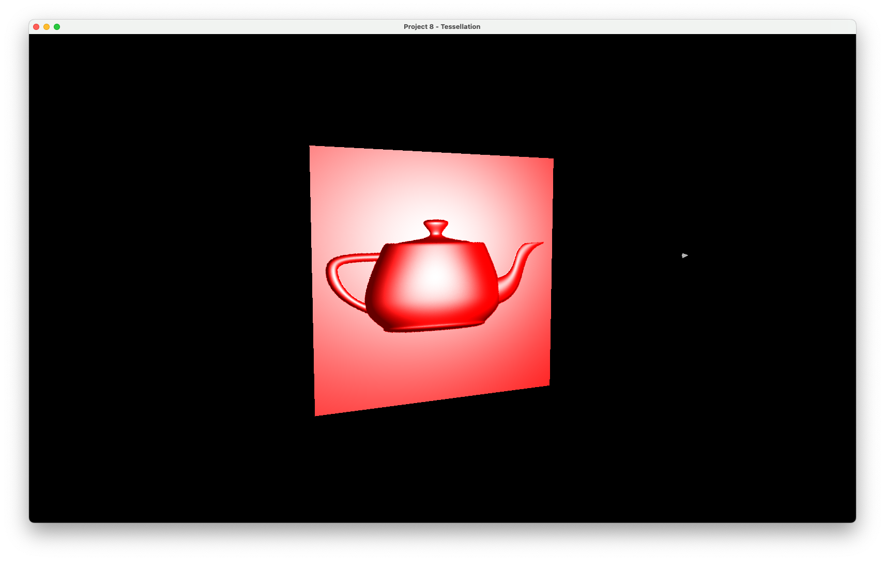
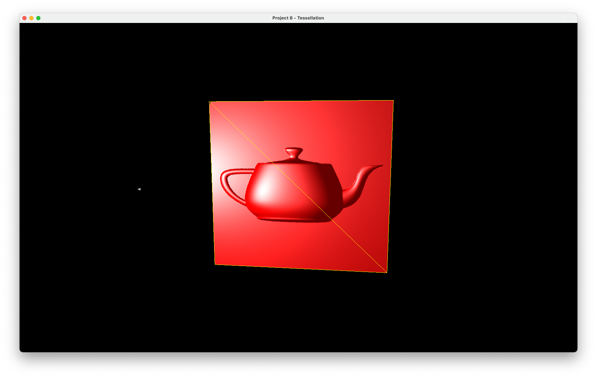
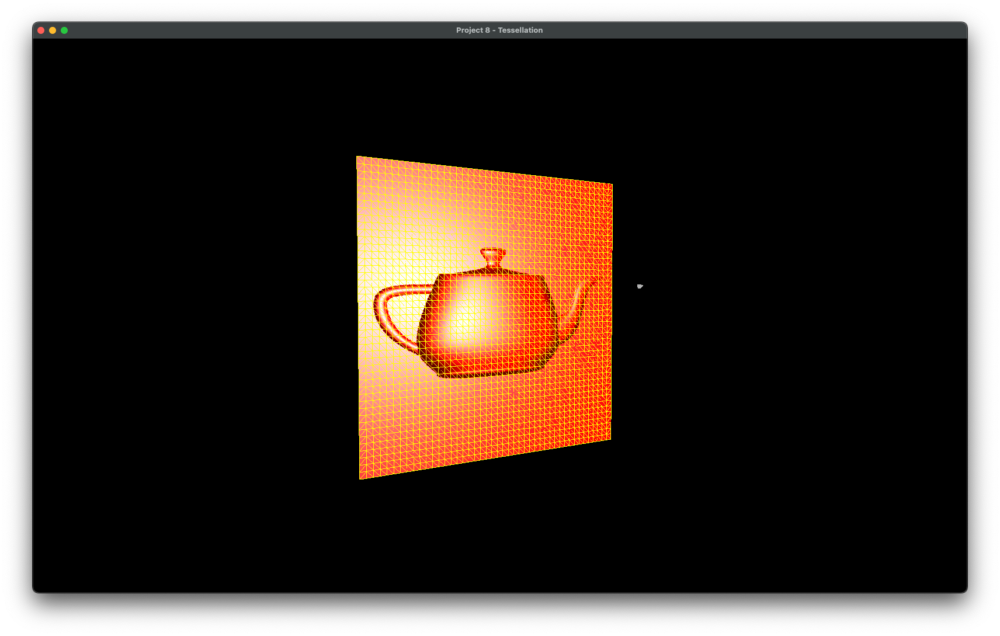
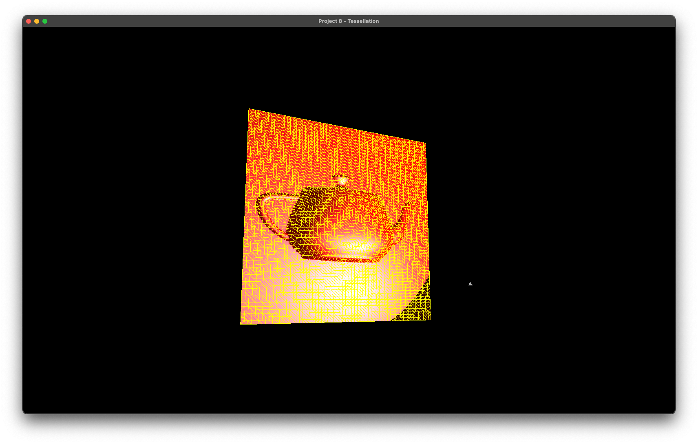
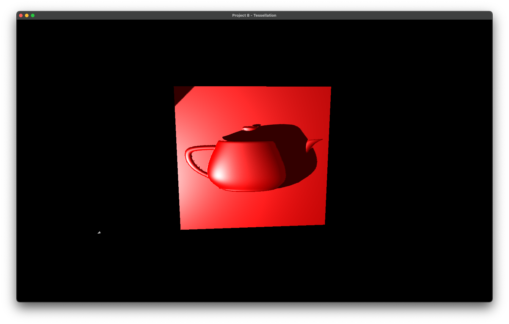

# CS 6610 Project 8 - Tessellation

## ScreenShot
The following pictures shows several steps of this implementation.
> #### Step 1 (Normal Mapping)
> #### Step 2 (Geometry Shader)
> #### Tessellation Shaders
> #### Step 3 (Displacement Mapping)
> #### Shadow Mapping

## What you implemented
1. Implemented normal mapping inside the fragment shader of the plane.
2. Added a seperate program to render the outline of the triangles with geometry shader.
3. Created a common TCS, and several TESs for each program, to have the tesselator work properly.
4. Implemented displacement mapping by modifying the z-cord value of vertex positions before transformed by Matrices.
5. (CS 6610 requirement) Implemented shadow mapping just as last project.

## How to use the implementation

This project is now a Clion project, so we need to run it under this IDE, or others that support cmake.

After download and setup the environment, then click Run in your IDE, and you will see a 16:10 window appear on your screen, contains a plane with a fake teapot integrating on it, with blinn shading and shadows. 

### List of Inputs

* Hold mouse left and drag, to rotate the view of the plane;
* Hold mouse left and drag, to rotate the light direction when ```ctrl``` is pressed; 
* Hold mouse right and drag, to zoom in/out the camera of the model.
* Hold mouse right and drag, to zoom in/out the light distance whrn ```ctrl``` is pressed.
* Press ```left arrow``` or ```right arrow``` to modify the tessellation level. 
* Press ```Esc``` to exit; 

## Envrionment, OS, External Libraries and Additional Requirements
I developed and tested this project on Latest MacOS 13.2.1, and the architecture is Apple Silicon (Arm64). 

### To setup environment:

1. install [HomeBrew](https://brew.sh).
2. In Terminal, run ```$ brew install glfw ```;
3. Go to [GLAD](https://glad.dav1d.de) online service, choose as this picture. Then click generate. 


4. Download the zip flie, copy the two folders inside the include folder to /opt/homebrew/include. 

The environment is now set up and ready for debugging the project you copied from me.
### To create a empty project under this environment:

1. Create a empty Clion Project. (Or other IDE supports Cmake)
2. Copy the src folder in glad to the root of project. 
3. Drag the main.cpp into src folder.
4. Under the root of project, create a folder named "include". For any external libraries, put in this folder. 
> The best practice for adding include libraries is to use ```git submodule add repo_url include/repo_name``` to have those external libraries installed if you are using git.
5. Then Modify the CMakeLists.txt like this:
```cmake
cmake_minimum_required(VERSION 3.24)
project(Your-Project-Name)

set(CMAKE_CXX_STANDARD 17)

set(CMAKE_OSX_ARCHITECTURES  "arm64" CACHE STRING "Build architectures for Mac OS X" FORCE)

set(GLFW_LINK /opt/homebrew/lib/libglfw.3.dylib)
link_libraries(${OPENGL} ${GLFW_LINK})

add_executable(Your-Executable-Name src/glad.c src/main.cpp)
target_include_directories(Your-Executable-Name PUBLIC /opt/homebrew/include)
target_include_directories(Your-Executable-Name PRIVATE ${PROJECT_SOURCE_DIR}/include)

if (APPLE)
    target_link_libraries(Your-Executable-Name "-framework OpenGL")
    target_link_libraries(Your-Executable-Name "-framework GLUT")
endif ()
```

### Miscs:

1. I also Included the cyCodeBase, but it's buggy on Apple Silicon Mac unless you disable immintrin.h by adding the first line on the top of main.cpp, as well as the second line to override gluErrorString function, before include cyGL.h:
    ```cpp
    #define CY_NO_IMMINTRIN_H
    #define gluErrorString(value) (#value)
    ```
2. For any included library, if it has any .cpp files, you need to add it to compile list by modfying the CMakeLists.txt like this:
    ```cmake
    add_executable(Your-Executable-Name src/glad.c [library cpp directories] src/main.cpp)
    ```