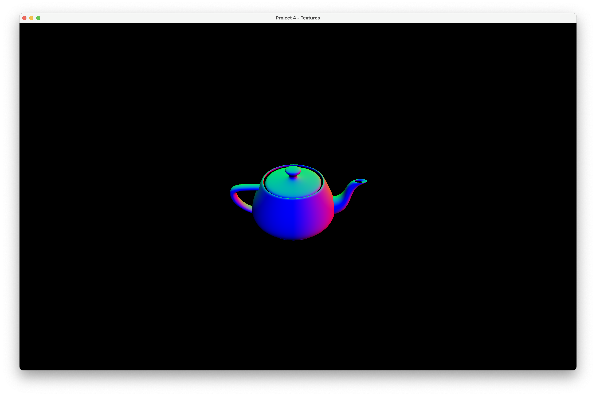
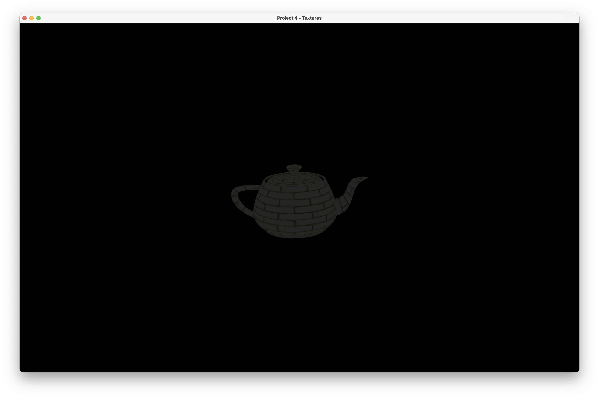
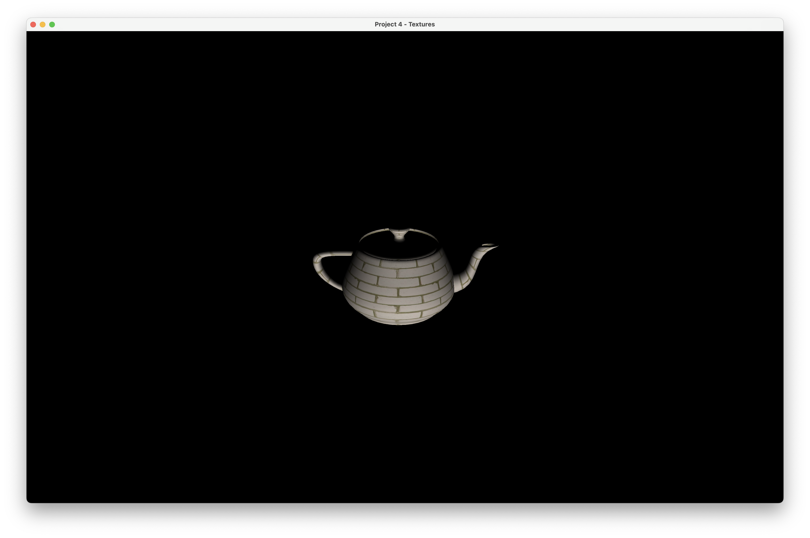
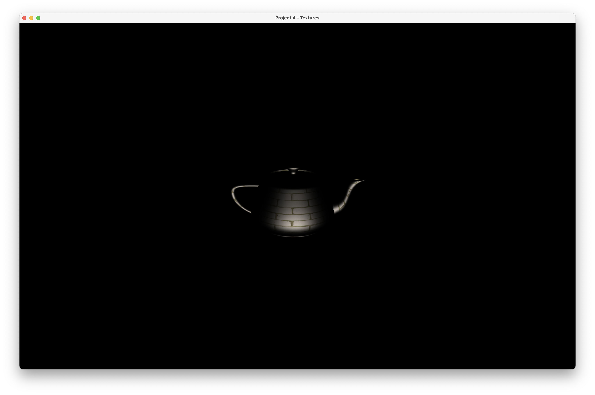
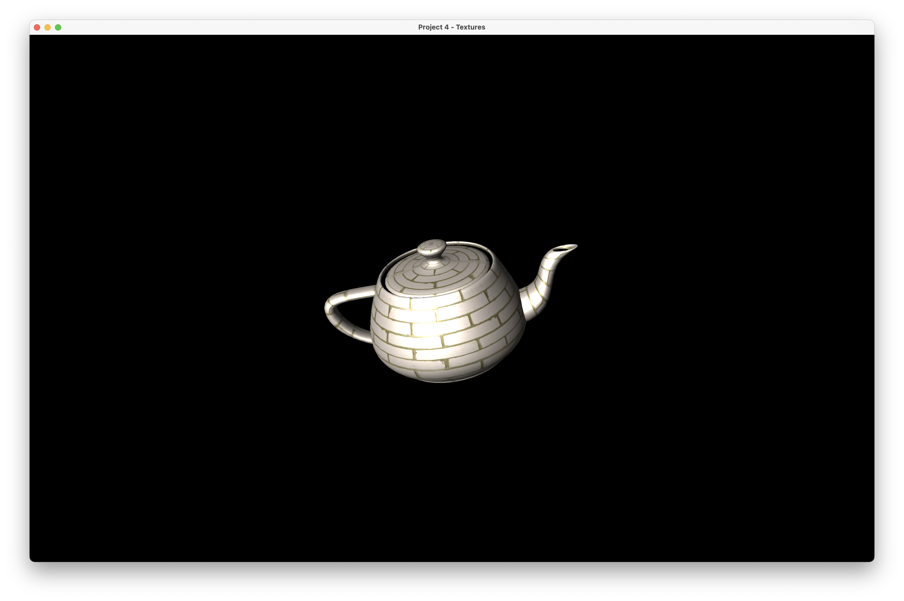

# CS 6610 Project 4 - Textures

## ScreenShot

The following pictures shows the Normal, Ambient, Diffuse, Specular and Blinn Result of the Textured teapot.

> #### Normal
> #### Ambient
> #### Diffuse
> #### Specular (Textured with Image)
> #### Blinn 

## What you implemented
1. Prepared texCoord buffer from the mesh data
2. Loaded multiple image data from png file.
3. In Vertex Shader, read & passed the texCoord data to next step.
4. In Fragment Shader, used texture sampler and texCoord to calculate Kd value for Ambient and Diffuse.
5. (CS 6610 Requirement) In Fragment Shader, used another texture sampler and texCoord to calculate Ks value for Specular.

## Additional functionalities beyond project requirements
For the generating of data and Element Buffer Object, I optimized a little bit to reduce the data dupilicating, which could save 50% - 70% memory consumption compared with the simplest method. For the texCoord Buffer, because it is usually less than the num of vertices, I defaultly copy it to each vertex data. 

```cpp
    std::vector<cyVec3f> positionBufferData;
    std::vector<cyVec3f> normalBufferData;
    std::vector<cyVec2f> texCoordBufferData;
    std::vector<GLuint> indexBufferData;

    unsigned int max = cy::Max(mesh.NV(),mesh.NVN());
    for(int vi = 0; vi < max; vi++){
        positionBufferData.push_back(vi < mesh.NV() ? mesh.V(vi) : mesh.V(0));
        normalBufferData.push_back(vi < mesh.NVN() ? mesh.VN(vi) : mesh.VN(0));
        texCoordBufferData.push_back(mesh.VT(0).XY());
    }

    for(int i = 0; i < mesh.NF(); i++){
        for(int j = 0; j < 3; j++){
            //Set up triangle vertex buffer data
            unsigned int index = mesh.F(i).v[j];
            unsigned int indexN = mesh.FN(i).v[j];
            unsigned int indexT = mesh.FT(i).v[j];
            if(indexN == index){
                indexBufferData.push_back(index);
                texCoordBufferData.at(index).Set(mesh.VT(indexT).x, mesh.VT(indexT).y);
            }
            else {
                bool added = false;
                for(unsigned int mi = max; mi < positionBufferData.size(); mi++){
                    if(positionBufferData.at(mi)==mesh.V(index) &&
                    normalBufferData.at(mi)==mesh.VN(indexN) &&
                    texCoordBufferData.at(mi) == mesh.VT(indexT).XY())
                    {
                        //This Duplicated vertex is already added, do not add again
                        added = true;
                        indexBufferData.push_back(mi);
                        break;
                    }
                }
                if(!added){
                    unsigned int newIndex = positionBufferData.size();
                    positionBufferData.push_back(mesh.V(index));
                    normalBufferData.push_back(mesh.VN(indexN));
                    texCoordBufferData.push_back(mesh.VT(indexT).XY());
                    indexBufferData.push_back(newIndex);
                }
            }
        }
    }
```  
## How to use the implementation

This project is now a Clion project, so we need to run it under this IDE, or others that support cmake.

After download and setup the environment, then click Run in your IDE, and you will see a 16:10 window appear on your screen, contains a textured teapot model with Blinn Shading. 

### List of Inputs

* Hold mouse left and drag, to rotate the view of the model;
* Hold mouse left and drag, to rotate the light direction when ```ctrl``` is pressed; 
* Hold mouse right and drag, to zoom in/out the camera of the model.
* Press ```Esc``` to exit; 
* Press ```F6``` to recompile the shader program.

## Envrionment, OS, External Libraries and Additional Requirements
I developed and tested this project on Latest MacOS 13.2.1, and the architecture is Apple Silicon (Arm64). 

### To setup environment:

1. install [HomeBrew](https://brew.sh).
2. In Terminal, run ```$ brew install glfw ```;
3. Go to [GLAD](https://glad.dav1d.de) online service, choose as this picture. Then click generate. 


4. Download the zip flie, copy the two folders inside the include folder to /opt/homebrew/include. 

The environment is now set up and ready for debugging the project you copied from me.
### To create a empty project under this environment:

1. Create a empty Clion Project. (Or other IDE supports Cmake)
2. Copy the src folder in glad to the root of project. 
3. Drag the main.cpp into src folder.
4. Under the root of project, create a folder named "include". For any external libraries, put in this folder. 
> The best practice for adding include libraries is to use ```git submodule add repo_url include/repo_name``` to have those external libraries installed if you are using git.
5. Then Modify the CMakeLists.txt like this:
```cmake
cmake_minimum_required(VERSION 3.24)
project(Your-Project-Name)

set(CMAKE_CXX_STANDARD 17)

set(CMAKE_OSX_ARCHITECTURES  "arm64" CACHE STRING "Build architectures for Mac OS X" FORCE)

set(GLFW_LINK /opt/homebrew/lib/libglfw.3.dylib)
link_libraries(${OPENGL} ${GLFW_LINK})

add_executable(Your-Executable-Name src/glad.c src/main.cpp)
target_include_directories(Your-Executable-Name PUBLIC /opt/homebrew/include)
target_include_directories(Your-Executable-Name PRIVATE ${PROJECT_SOURCE_DIR}/include)

if (APPLE)
    target_link_libraries(Your-Executable-Name "-framework OpenGL")
    target_link_libraries(Your-Executable-Name "-framework GLUT")
endif ()
```

### Miscs:

1. I also Included the cyCodeBase, but it's buggy on Apple Silicon Mac unless you disable immintrin.h by adding the first line on the top of main.cpp, as well as the second line to override gluErrorString function, before include cyGL.h:
    ```cpp
    #define CY_NO_IMMINTRIN_H
    #define gluErrorString(value) (#value)
    ```
2. For any included library, if it has any .cpp files, you need to add it to compile list by modfying the CMakeLists.txt like this:
    ```cmake
    add_executable(Your-Executable-Name src/glad.c [library cpp directories] src/main.cpp)
    ```