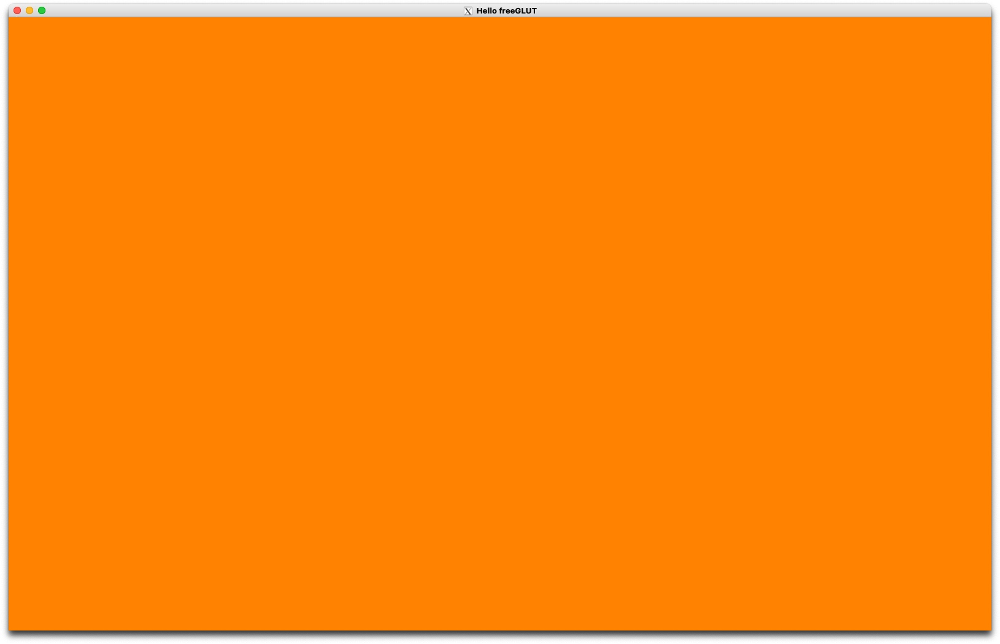
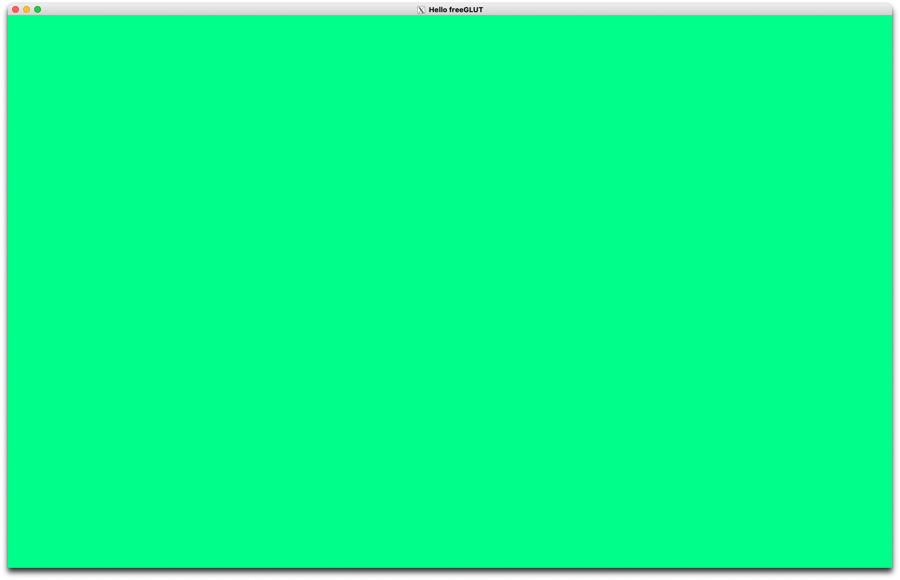
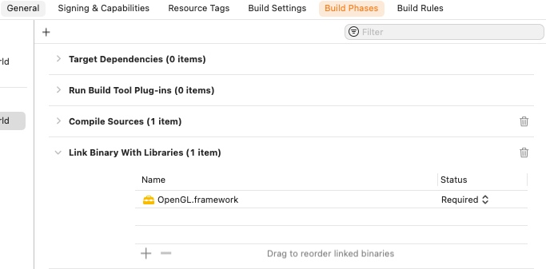
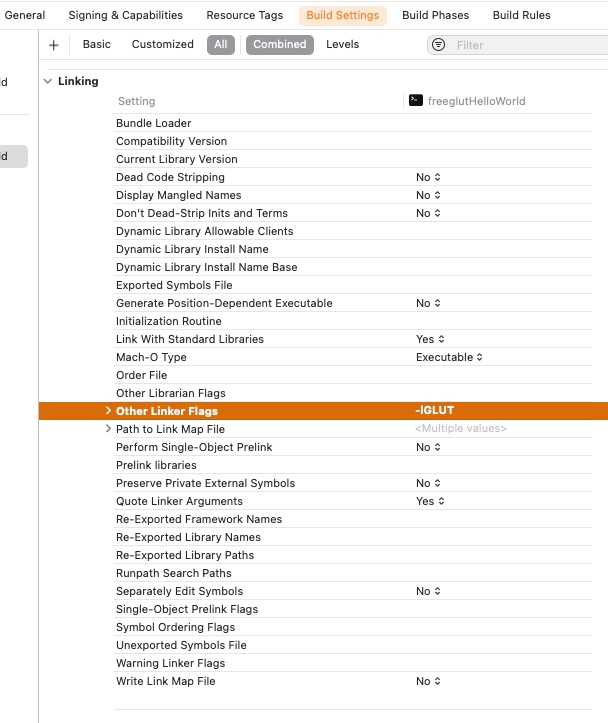
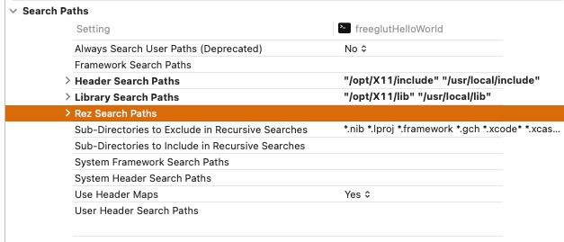

# CS 6610 Project 1 - Hello World!

## What you implemented
1. Basic GLUT loop
2. Keyboard function, to close the window after pressed Esc.
3. Background color animation.

## ScreenShots

These 2 images shows the clear color animation function I implemented. 






## Additional functionalities beyond project requirements

Implementation of BG animation utilized HSV color space, to make it smooth.

``` cpp
void idle(void){
    //allocate color channel variables
    GLclampf r;
    GLclampf g;
    GLclampf b;
    
    //Change the Hue Through Time
    int hue = (glutGet(GLUT_ELAPSED_TIME) / 30) % 360;
    
    //Convert Color from HSV to RGB(A)
    HSV2RGB(hue, 80, 100, r, g, b);
    
    //Reset Clear Color
    glClearColor(r, g, b, 1);
    
    //Redraw
    glutPostRedisplay();
}
```

## How to use the implementation
It should work well in any "standard" GLUT/freeGLUT evironments.

After setup, copy the main.cpp to the project folder, then click Run in your IDE, and you will see a 16:10 window appear on your screen, with the BG color animated. Click Esc to exit.

## Envrionment, OS, External Libraries and Additional Requirements
I developed and tested this project on Latest MacOS 13.1, and the chip is Apple Silicon (Arm64). I have figured out a possible setup instruction for all modern mac users for such projects.

1. install [HomeBrew](https://brew.sh).
2. In Terminal, run ```$ brew install freeglut ```
3. Download and install [XQuartz](https://www.xquartz.org), as the container of GLUT.
4. Create a Xcode C++ console application Project. Then Click on the project item in the left bar, to access project settings.
5. In Build Phases Page, Add OpenGL.framework to "Link Binary With Libraries". 

6. In Build Setting Page, set Other Linker Flags as ```-lGLUT```. 

7. Still in that page, find out Search Paths, set Header Serach Paths as ``` "/opt/X11/include" "/usr/local/include" ```, and set Library Search Path as ``` "/opt/X11/lib" "/usr/local/lib" ```. 

The environment is now set up and could run properly.
