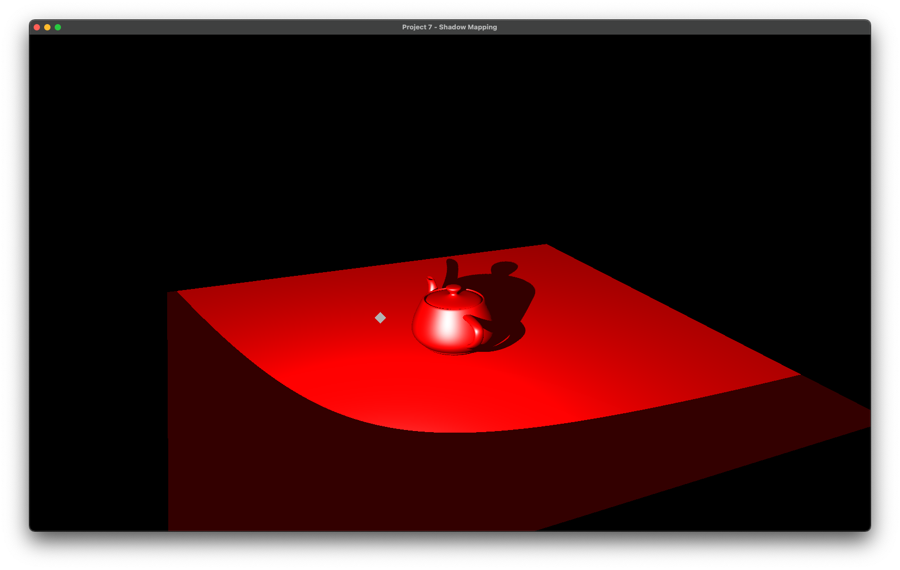

# CS 6610 Project 7 - Shadow Mapping
## ScreenShot

## What you implemented
1. Rendered the depth buffer to shadow map from the perspective of the spotlight.
2. Calculated the shadow result into the color value of the fragment shader in world camera.
3. Also cast the shadow on a plane under the teapot, by render it in the same pass of rendering the teapot.
4. (CS 6610 Requirement) Control the spotlight position independently, form 3 parameters: distance, theta and phi, just like the camera.
5. (CS 6610 Requirement) Created a hint object which represents the position and orientation of the spotlight, from data.

## Additional functionalities beyond project requirements

Since we have a spotlight, only calculate the shadow from a constant color is not ideal for rendering. In the fragment shader of the main pass, I turned the Blinn material receiving the blinn color from spotlight parameters.

```glsl
//shader.frag
# version 410 core

in vec3 worldPos;
in vec3 worldNormal;
in vec4 lightViewPos;

out vec4 color;

uniform vec3 camPos;
uniform vec3 spotDir;
uniform vec3 lightPos;
uniform float lightFovRad;
uniform sampler2DShadow shadow;

void main(){
    color = vec4(0,0,0,1);

    //Compute Ambient
    vec3 Kd = vec3(1,0,0);
    float Intensity_A = 0.2;
    vec3 C_Ambient = Intensity_A * Kd;

    //Determine if light is on this fragment;
    vec3 lightDir = normalize(lightPos - worldPos);
    float angle = max(acos(dot(spotDir, -lightDir)),0);
    if(angle <= lightFovRad) {
        //Compute Diffuse, Specular and Blin
        vec3 normal = normalize(worldNormal);
        vec3 viewDir = normalize(camPos - worldPos);
        vec3 halfDir = normalize(lightDir + viewDir);

        vec3 Ks = vec3(1,1,1);
        int alpha = 10;
        float Intensity = 1;

        vec3 C_Diffuse = Intensity * max(dot(normal, lightDir),0.0)* Kd;
        vec3 C_Specular = Intensity * pow(max(dot(normal, halfDir), 0.0), alpha) * Ks;
        vec3 C_Blinn = C_Ambient + C_Diffuse + C_Specular;

        color += vec4(C_Blinn,0);
    }

    //Compute Shadow
    color *= textureProj(shadow, lightViewPos);
    color += vec4(C_Ambient,0);
}
```

As you can see in the last line, I added the Ambient component after calculate the shadow, to avoid having pure black fragment, which makes the shadow more significant from the clear color.

## How to use the implementation

This project is now a Clion project, so we need to run it under this IDE, or others that support cmake.

After download and setup the environment, then click Run in your IDE, and you will see a 16:10 window appear on your screen, contains a teapot model with Blinn Shading, casting its shadows on the underneath plane, as well as itself. 

### List of Inputs

* Hold mouse left and drag, to rotate the view of the model;
* Hold mouse left and drag, to rotate the light direction when ```ctrl``` is pressed; 
* Hold mouse right and drag, to zoom in/out the camera of the model.
* Hold mouse right and drag, to translate the light position from/to the scene center when ```ctrl``` is pressed; 
* Press ```Esc``` to exit; 

## Envrionment, OS, External Libraries and Additional Requirements
I developed and tested this project on Latest MacOS 13.2.1, and the architecture is Apple Silicon (Arm64). 

### To setup environment:

1. install [HomeBrew](https://brew.sh).
2. In Terminal, run ```$ brew install glfw ```;
3. Go to [GLAD](https://glad.dav1d.de) online service, choose as this picture. Then click generate. 


4. Download the zip flie, copy the two folders inside the include folder to /opt/homebrew/include. 

The environment is now set up and ready for debugging the project you copied from me.
### To create a empty project under this environment:

1. Create a empty Clion Project. (Or other IDE supports Cmake)
2. Copy the src folder in glad to the root of project. 
3. Drag the main.cpp into src folder.
4. Under the root of project, create a folder named "include". For any external libraries, put in this folder. 
> The best practice for adding include libraries is to use ```git submodule add repo_url include/repo_name``` to have those external libraries installed if you are using git.
5. Then Modify the CMakeLists.txt like this:
```cmake
cmake_minimum_required(VERSION 3.24)
project(Your-Project-Name)

set(CMAKE_CXX_STANDARD 17)

set(CMAKE_OSX_ARCHITECTURES  "arm64" CACHE STRING "Build architectures for Mac OS X" FORCE)

set(GLFW_LINK /opt/homebrew/lib/libglfw.3.dylib)
link_libraries(${OPENGL} ${GLFW_LINK})

add_executable(Your-Executable-Name src/glad.c src/main.cpp)
target_include_directories(Your-Executable-Name PUBLIC /opt/homebrew/include)
target_include_directories(Your-Executable-Name PRIVATE ${PROJECT_SOURCE_DIR}/include)

if (APPLE)
    target_link_libraries(Your-Executable-Name "-framework OpenGL")
    target_link_libraries(Your-Executable-Name "-framework GLUT")
endif ()
```

### Miscs:

1. I also Included the cyCodeBase, but it's buggy on Apple Silicon Mac unless you disable immintrin.h by adding the first line on the top of main.cpp, as well as the second line to override gluErrorString function, before include cyGL.h:
    ```cpp
    #define CY_NO_IMMINTRIN_H
    #define gluErrorString(value) (#value)
    ```
2. For any included library, if it has any .cpp files, you need to add it to compile list by modfying the CMakeLists.txt like this:
    ```cmake
    add_executable(Your-Executable-Name src/glad.c [library cpp directories] src/main.cpp)
    ```